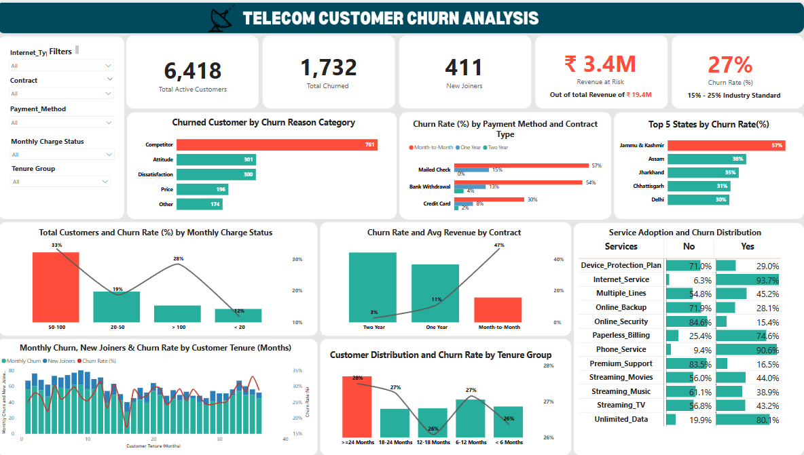

# Telecom Customer Churn Analysis 

## Project Background

A leading telecom company in India is experiencing rising customer churn—a major threat to recurring revenue and long-term growth. With growing competition, fluctuating service quality, and fragmented customer engagement, the company wants to better understand why customers are leaving and which segments are most at risk.

As a data analyst for this project, I analyzed churn-related data to identify churn drivers, quantify revenue at risk, and recommend actionable strategies for customer retention.

### Business Model

- Subscription-based, recurring revenue from internet, phone, and digital services.
- Customers can select from flexible contract lengths and payment methods.
- **Key business metrics:** active customers, churn rate, revenue at risk, new joiners.

### Key Data Assets

- Customer-level data (demographics, tenure, contract/payment/service details, churn status, revenue).
- Data is cleaned and transformed using SQL and Power BI, with key tables including:
  - `prod_Churn` (core customer data)
  - `mapping_TenureGrp` (tenure buckets)
  - `prod_Services` (service adoption matrix)
  - `tbl_measures` (All the DAX Formulas are saved here)

### Tools Used

- **SQL:** Data cleaning and transformation
- **Power BI:** Dashboard design, DAX calculations, interactive filtering
- **Power Query:** Dimension mapping, custom grouping

### Key KPIs

| KPI                | Value        |
|--------------------|-------------|
| Total Customers    | 6,418       |
| Churned Customers  | 1,732       |
| New Joiners        | 411         |
| Churn Rate         | 27%         |
| Revenue at Risk    | ₹3.4M       |

---

## Focus Areas

- KPI Tracking: Core metrics on churn, retention, and revenue impact
- Customer Tenure & Lifecycle Analysis
- Contract & Payment Method Risk Segments
- Churn Reason Categorization
- Service Adoption Impact on Churn

---

## Dataset & Structure

### Tables Used

| Table Name         | Description                                | Key Fields                                  |
|--------------------|--------------------------------------------|---------------------------------------------|
| prod_Churn         | Cleaned customer dataset with churn status  | Customer_ID, Tenure, Contract, Monthly Charges, Churn Status |
| prod_Services      | Unpivoted table for service usage           | Customer_ID, Service Name, Has_Service      |
| mapping_TenureGrp  | Tenure group binning reference              | Tenure, Tenure_Group                        |
| tbl_measures       | All KPI and DAX calculations                | Churn Rate, Revenue at Risk, etc.           |

---

## Executive Summary

The company maintained ~6,400 active customers, but **1,732 customers churned**—a churn rate of **27%**, higher than the industry benchmark of 15-25%.  
**Revenue at Risk** was estimated at **₹3.4M**, based on average customer value and churn volume.

### Top 5 Takeaways

1. **Month-to-Month contracts have the highest churn rate (47%)**
2. **Competitor-related reasons account for ~44% of churn**
3. **Low-tenure (24 months) customers churn more**
4. **Low adoption of services like Online Security = higher churn**
5. **High-churn states include Jammu & Kashmir (57%) and Assam (38%)**

---

## Insights Deep Dive

### Category 1: Churn Drivers & Segmentation

**Contract Type is the Primary Churn Driver**  
- Month-to-Month contracts have a churn rate of **47%** (1,529 out of 3,286 active), compared to **11%** for One Year and **3%** for Two Year contracts.
- Month-to-Month customers make up the majority of all churned customers (1,732 total).
- Churn risk drops dramatically with longer contracts, confirming the retention value of commitment periods.

  
**Payment Method Significantly Impacts Churn**  
- Within Month-to-Month contracts, Mailed Check users churn at **57%**, Bank Withdrawal at **54%**, while Credit Card users churn at **30%**.
- Mailed Check and Bank Withdrawal users are almost twice as likely to churn as Credit Card users.
- Digital payment methods are associated with higher retention.

**Price Sensitivity Drives Churn in Key Segments**  
- The **₹50-100/month** segment has the highest churn rate at **52%** (Month-to-Month), and is the largest group.
- Churn rates drop to **35%** for ₹20-50 and **27%** for <₹20, indicating mid-tier pricing is a churn hotspot.
  
**Competitor Activity is the Leading Churn Reason**  
- **44%** of churned Month-to-Month customers (674 out of 1,529) cite "Competitor" as their reason for leaving, outpacing all other categories.
- Competitor-driven churn is more than double any other single reason.

**Month-to-Month contact Customer** 
- Month-to-Month contract customers are the epicenter of churn, with a **47% churn rate** (1,529 out of 3,286), far above the industry benchmark.
- Risk amplifiers: Mailed Check and Bank Withdrawal (57% and 54% churn), ₹50-100/month charge segment (52% churn).
- Geography: Jammu & Kashmir (77%) and Assam (61%) are high-risk states.
- Service Adoption: Most churned customers lack add-ons (75% without Device Protection, 87% without Online Security).

---

### Category 2: Revenue Impact

**Revenue at risk is ₹3.4M (18% of total revenue) due to churn.**
  
**Month-to-Month contracts contribute the largest share of at-risk revenue.**  
- This group alone is responsible for **₹2.3M** of the total revenue at risk.
  
**Mailed Check/Bank Withdrawal payment methods are linked to disproportionately high revenue loss.**  
- These payment types, especially when combined with Month-to-Month contracts, are overrepresented among high-value churned customers.

**The ₹50-100/month segment is the single largest source of lost revenue.**  
- This group combines high churn rates with the largest customer base, compounding the financial impact.

**Micro-Segment Analysis**
- The micro-segment (Month-to-Month + Mailed Check + ₹50-100/month) has a **64% churn rate** (60 out of 94 active), and **₹42,000 in revenue at risk**.
- **58%** cite competitors as the churn reason; churn is above **60%** across all tenure groups, peaking at **73%** for <6 months.
- Several states show **100% churn** in this group; over 80% lack add-ons.

---

### Category 3: Customer Lifecycle & Tenure

**Churn is highest in the first 6 months (26%) and for customers with tenure ≥24 months (47%).**
- Early and late-stage customers are most vulnerable.

 
**The largest customer group (≥24 months) also has the highest churn volume.**
- Retaining long-tenured customers is as critical as onboarding new ones.

**Mid-tenure customers (12-24 months) have slightly lower churn (26-27%).**
- This suggests a "honeymoon" period with reduced churn risk.

**New joiners (67) are not keeping pace with churned customers (279) in the <6 months group.**
- High early attrition threatens customer lifetime value and growth.

**New customers (<6 months)**
- New customers (<6 months) have a **26% churn rate** (279 out of 1,058), and **₹484.9K revenue at risk**.
- **45%** cite competitors; Month-to-Month contracts have a **46% churn rate** in this group; Mailed Check is especially risky (**63% churn**).
- **72-85%** lack add-ons.

---

### Category 4: Service Adoption
 
**94% of churned customers had Internet Service; 91% had Phone Service.**

**Only 12-25% of churned customers had add-ons (Device Protection, Online Security, Premium Support).**

**Customers without Online Security or Premium Support are far more likely to churn (over 80% of churned customers lack these services).**

**Churned customers are less likely to have multiple lines or streaming services.**

**Based on Service**
- Across all segments, churned customers are far less likely to have add-ons: only 12-25% have Device Protection, Online Security, or Premium Support, and over 80% lack these sticky services.
- Customers with more add-ons are significantly more likely to stay.

---

## Recommendations

Based on the insights and findings above, we recommend the following actions for the executive and retention teams:

- **Targeted Retention:** Focus on Month-to-Month customers, especially those paying by Mailed Check or Bank Withdrawal, and those in the ₹50-100/month segment.
- **Contract Upgrades:** Launch campaigns to incentivize upgrades to longer-term contracts (discounts, loyalty rewards, bundled offers).
- **Payment Modernization:** Promote digital payment methods to reduce churn risk and improve customer experience.
- **Upsell Add-Ons:** Increase awareness and adoption of value-added services (Device Protection, Online Security, Premium Support) among at-risk segments.
- **Competitor Response:** Benchmark and respond to competitor offerings, especially in high-churn states and among price-sensitive customers.

---

## Assumptions and Caveats

- Missing or ambiguous state data was excluded from regional analysis.
- Monthly charge ranges and tenure groups were custom-binned for clarity in visuals.
- Service adoption matrix is based on unpivoted data, which may include some overlap for multi-service customers.
- Revenue at risk calculations assume accurate and complete revenue data per customer.
- Churn reasons are based on customer-reported data, which may have subjective bias.

---

## Dashboard Preview

*(Add screenshots or a link to an embedded dashboard here)*

---

## Supporting Resources

- SQL queries used to inspect and clean the data for this analysis can be found here: [link]
- Targeted SQL queries regarding various business questions can be found here: [link]
- An interactive Tableau dashboard used to report and explore sales trends can be found here: [link]

---

## Suggestions to Make It Even More Professional & Insightful

- **Add a Table of Contents** at the top for easier navigation.
- **Include a dashboard screenshot or KPI card image** near the top for instant context.
- **Clarify data source and period** (e.g., “Simulated data, 2021–2023”).
- **Add a “How to Use This Repo” section** for other analysts or recruiters.
- **Make recommendations measurable** (e.g., “Reduce churn in Month-to-Month contracts by 5 percentage points in 6 months”).
- **Consistent heading levels** and bullet formatting throughout.

